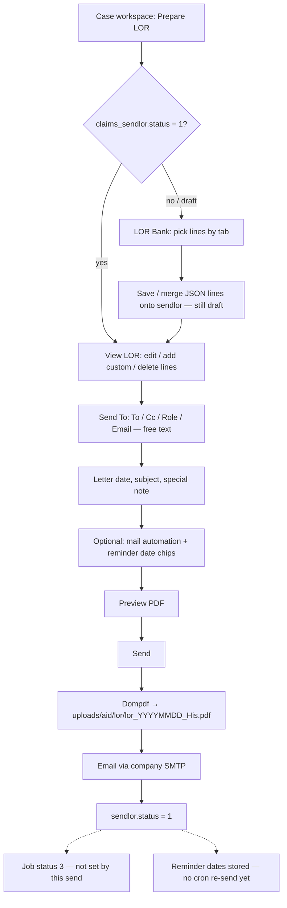

# Claims Mitra job workflow

This is how a job moves through the product. Stages are **W-01 … W-12**. Seats and money follow [DOMAIN_RULES.md](DOMAIN_RULES.md). Changing a stage means amending this file and the decision log.

Code source of truth for stage numbers and seats: `application/config/workflow.php`.

---

## Parties on the job (before any stage)

| Seat | Who | Rule |
|---|---|---|
| Assigner | Person at an **Insurer CIN** or **Broker CIN** office | R-05, R-06 |
| Policy office / appointing office / pay office | Three assigner offices (may be different CINs) | R-07 |
| Prime assignee | **Surveyor CIN** (individual or corporate), identified by name + SLA | R-03, R-08 |
| Survey branch | GST office of that Surveyor CIN | R-02 |
| Handler | File owner inside the Surveyor CIN | R-16 |
| Named SLA | Signs if the product is a licensed survey | R-12 |
| Field / inspector | Internal employee or external subcontractor | R-08 |
| Accounts | Billing, TI, dispatch, receipts | R-17 |

---

## Assignment class: REG or STY

Every case is marked **REG** (regular) or **STY** (stereotype) when it is entered. Both classes **require media** (photos and videos) on the file before the report can be received. They differ only on ILA and LOR.

| Class | Media | ILA (Immediate Loss Advice) | LOR | Then |
|---|---|---|---|---|
| **REG** | Required | Required | Required | Report |
| **STY** | Required | Not on the path | Not on the path | Straight to reporting |

Report is the **meeting point**. It may be prepared online (template) or offline; the system must still receive the report **together with** photos and videos. Media may arrive by upload, WhatsApp, live survey, or the Claims Mitra inspection app (any mix).

**Rule:** R-29.

---

## Happy path

```
W-01 Appoint  →  W-02 Land on desk  →  W-03 Handler owns file
      →  W-04 Field + media (both REG and STY)
      →  REG only: W-05 ILA then W-06 LOR
      →  STY: skip W-05 and W-06
      →  W-07 Report (meeting point) — online or offline, with media already/also on the file
      →  W-08 Bill (pay office) + TI
      →  W-10 Dispatch (portal / email / post / handover) — recorded, to pay office and/or other office
      →  W-11 Await payment advice → chase balance or archive
      →  W-12 Archived in record — keep file and media ≥ 3 years
```

Cancel may happen from W-03 onward → status **Cancelled (11)**. Appointment transfer (R-07) may happen at W-01/W-02 without cancelling.

---

### W-01 — Appoint

**Who:** Insurer CIN or Broker CIN person.  
**What:** Create or send a job to a **Surveyor CIN** (individual or corporate). Record product + LOB, loss location, policy / appoint / pay offices, assigner person.  
**Job status:** not yet on the surveyor’s incoming book, or incoming with no handler (`uid_to` empty).  
**Rules:** R-05, R-07, R-20, R-21.

**Why:** The marketplace starts with an assignor. Without the three offices, the later bill hits the wrong GSTIN.

---

### W-02 — Land on a survey desk

**Who:** Surveyor admin or LOB supervisor at the appointed **branch + LOB**.  
**What:** Job sits on that desk. Unassigned files (`uid_to = 0`) are the **supervisor book**, not every handler’s inbox.  
**Rules:** R-14, R-15, R-18.

**Why:** “Keep control under their own head.” If every company user sees every file, there is no desk.

---

### W-03 — Handler owns the file

**Who:** Supervisor/admin gives the job to a handler (including themselves). `uid_to` = handler.  
**What:** One handler. They may send field work internal or external; that does not change prime assignee or AR.  
**Visibility:** Handler sees **own** jobs only. Supervisor/admin sees **all** jobs on mapped LOB/branch, including unassigned.  
**Rules:** R-08, R-16, R-17.

**Why:** Dual owners stall TAT and reports.

---

### W-04 — Field work and media (status **1 Under Survey**)

**Who:** Handler + inspectors.  
**What:** Collect photos/video/data. **Required for both REG and STY.** Sources may mix: web/app upload, WhatsApp, live survey, Claims Mitra inspection app. Licensed survey still needs a covering SLA to sign later (R-12).  
**Code status:** `1`.  
**Rules:** R-29.

---

### W-05 — ILA (status **2**) — **REG only**

Immediate Loss Advice. **Mandatory on REG.** **Not on the STY path** (STY does not skip media; it skips this document).  
**Code status:** `2`.  
**Rules:** R-29.

---

### W-06 — LOR (status **3**) — **REG only**

Letter of Requirement: a checklist of documents asked from the insured / insurer, issued as a PDF letter and emailed. **Mandatory on REG after ILA. Not on the STY path.**

**Job status (spec):** `claims_livelocationjob.status = 3` (LOR Sent).  
**Letter row (as built):** `claims_sendlor.status` **0 = draft**, **1 = sent**. These are **different** statuses.

**Rules:** R-29.

#### Where LOR sits on the job

```mermaid
flowchart TD
  W04[W-04 Field + media]
  class{REG or STY?}
  ILA[W-05 ILA]
  LOR[W-06 LOR]
  RPT[W-07 Report — meeting point]

  W04 --> class
  class -->|REG| ILA
  ILA --> LOR
  LOR --> RPT
  class -->|STY: skip ILA and LOR| RPT
```

#### Letter workflow as built (`Assignment`: `/preparelor` → `/viewlor`)

One `claims_sendlor` row per assignment `aid`. Bank lines live in `claims_lor` (tabs by name: Motor, Marine, Fire, MBD, Project, Fraud/Fidelity, Burglary, ATM — not firm LOB ids).



**After send:** Prepare LOR redirects to View LOR. Recipients are **not** bound to appointing / paying / concerned offices. Reminder chips (`automail_fix`) are stored; nothing currently re-sends on those dates.

**Gap vs this spec:** STY jobs can still open the LOR screens. Sending the letter does **not** move the job to status 3.

---

### W-07 — Report (status **4**) — meeting point

Both REG and STY arrive here. Report may be prepared **online** (template) or **offline**; either way the system must receive it **along with** photos and videos. Handler owns writing; named SLA signs if required.  
**Code status:** `4`.  
**Rules:** R-12, R-16, R-29.

---

### W-08 — Bill (status **5 Billing**)

Accounts (or admin) raises **one bill per job** against the **pay office** (or cash party). Ship-to = appointing office. Vendor code of this Surveyor CIN at the paying Insurer CIN must persist and print.  
**Code status:** `5`.  
**Rules:** R-22, R-23, R-24, R-25, R-26.

---

### W-09 — Tax invoice issued (status **6** then **7**)

TI number and date make the bill issued. Job is then **pending dispatch**.  
**Code status:** `6` Waiting for TI, `7` Pending for dispatch.  
**Who sees this book:** Accounts and admin (R-17).

---

### W-10 — Dispatch (status **8**)

**After billing**, deliver the report (and invoice). **Must record** each act (R-30):

| Mode | Code | Extra |
|---|---|---|
| Physical handover | 1 | Who received |
| Post | 2 | Tracking no. |
| Online portal | 3 | Portal / reference |
| Email | 4 | Address sent to |

**To:** paying office and/or other concerned office. Multiple dispatches allowed. Then **await payment advice** — dispatched is not closed.  
**Code status:** `8`.  
**Rules:** R-30, R-31.

---

### W-11 — Payment advice (status **9** if balance)

When advice is received, record it on the bill (R-27). If a **balance** remains, **pursue** it (partial **9**). If settled, archive. No advice yet = still waiting after dispatch.  
**Rules:** R-31.

---

### W-12 — Archived (status **10**) or cancelled (**11**)

Settled cases are **archived in the record**, not deleted. Cancelled needs a reason. **File + media retained at least 3 years.**  
**Rules:** R-32.

---

## Access by seat (W-03 / R-17)

| Connect `usertype` | Seat name | Incoming / dashboard jobs |
|---|---|---|
| **2** | Surveyor admin (and acting supervisor for the selected LOB) | All jobs for that Surveyor CIN + selected LOB, including unassigned |
| **3** | Handler | Only `uid_to` = self |
| **4** | Accounts | Billing onward (statuses 5–10): TI, dispatch, receipts |
| **1** | Individual (one-person practice / own files) | Only `uid_to` = self |

Overlapping hats (R-15): the header company + LOB + role is the **seat you are working as**. Switch role to see the other book.

Until a distinct “supervisor” usertype exists, **usertype 2** is the supervisor book for the selected LOB. That is an implementation stand-in, not a new rule.

---

## What this workflow does not do yet

- Persist **REG/STY** on the job and skip ILA/LOR in code for STY (R-29 is spec; status chain is still linear). Sending LOR does not set job status **3**; reminder dates are stored but not executed.
- Distinct supervisor usertype vs admin (R-15 full tree).
- Survey branch (GST) in the session switcher (still company + department).
- Native foreign-currency invoices (R-26); USD/NPR remain a later change.
- Formal appointment-transfer log (R-07 history).
- Auto-file WhatsApp / live / inspection-app media onto `aid` as first-class sources.
- Enforce 3-year retention in storage (R-32 is policy; no purge job yet).

---

## Decision log

| Date | Decision | Effect |
|---|---|---|
| 2026-08-18 | Adopt W-01–W-12 and seat visibility above. Incoming lists follow handler vs admin vs accounts. | `workflow.php` + incoming/dashboard filters. Vendor code persisted on bill save (R-23). |
| 2026-08-18 | REG vs STY. Both require media. REG requires ILA then LOR. STY skips those two and goes to report. Report is the meeting point. | R-29. W-04–W-07 amended. |
| 2026-08-18 | After bill: record dispatch (portal/email/post/handover, to pay or other office); await payment advice; chase balance or archive; retain ≥ 3 years. | R-30–R-32. W-10–W-12 amended. |
| 2026-08-18 | Document LOR letter flow as built vs job stage W-06. | W-06 diagrams. |
